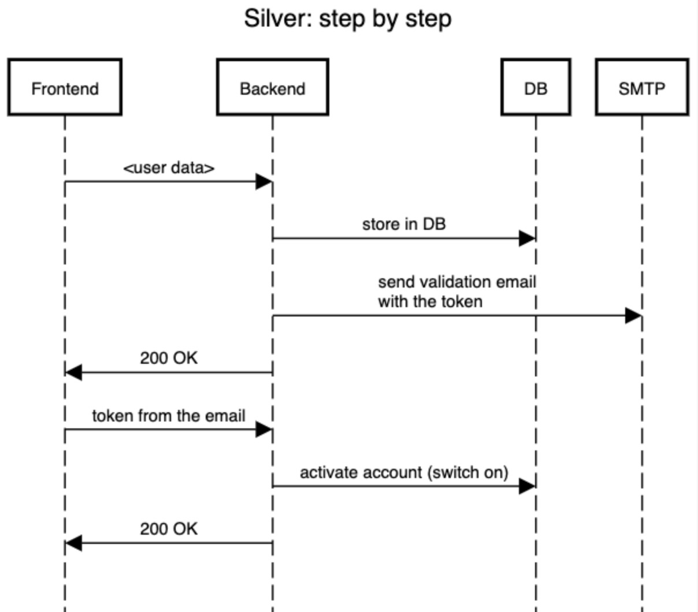
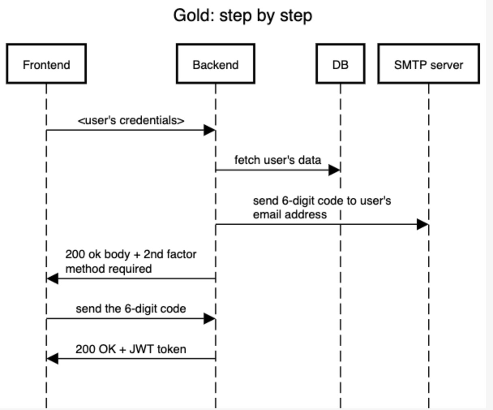
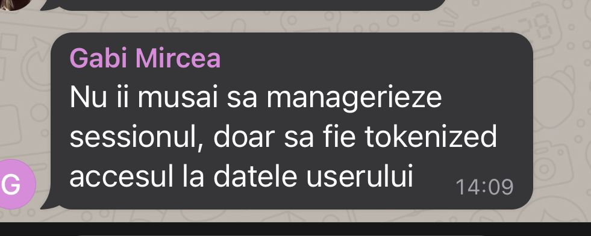

## LAB HOLIDAY: MPP [ LOGIN-REGISTER-AUTHENTICATION ] [BACKEND DEPLOYMENT]

**DUE WEEK : WEEK AFTER THE EASTER BREAK**

MANDATORY requirements for presenting the assignment(with
grade 5):

**LOGIN-REGISTER-AUTHENTICATION**

- implement login/register capabilities for the users of your
  application
- ensure the fact that each user can access their private
  information via tokens
- implement session management

**BACKEND DEPLOYMENT**

- deploy the backend of your application on any of the
  deployment platforms available that you prefer ( e.g. aws )

Silver and gold challenges will be given by your teacher during
the lab:

- implementing the silver challenge gives you extra 2
  points to your lab grade for this assignment
- implementing the gold challenge gives you extra 3
  points
- silver and gold challenges are not mandatory

### Lab Teacher:

Salut! Sper ca ati vazut assign ul pe teams. Va trimit gold si silver imediat

Silver: Account activation via Email

- After registration, send an email to the user with an activation link
  - The link must contain a token used to validate the account
  - If the user tries to login and the account is not validated, the backend call must return 403 FORBIDDEN with a message in the body (send an object)
  - The link is for the frontend, which will forward the token to the backend in a call
    - A page is rendered in the frontend (you can display some nice message like "Validating your email address… DONE!"
    - Actually, behind this page is a call to the backend (fetch, axios etc…) which will use the token present in the browser URL
    - After 201 is received from the backend, you can display a success message. Eventually you can redirect the user to the login page after ~5 seconds, but it's not mandatory. You should at least include a link to the login page
    - If no account is linked to that validation token, you must display the right message (ex: "Could not find any account linked to this email… Maybe sign up first?")
  - Validation is kept under a flag in the DB (a bool column)

Gold: Implement a 2nd factor auth method

- After the user logs in, you should send a 200 OK message with the following code in the message body:

        // this is a response body example, you can
        // design your own
        {
            "data": {
            "code": "2ND_FACTOR_REQUIRED"
            },
            "errors": []
        }

- If the login was successful:
  - DO NOT SEND the JWT token yet
  - Send a 6 digit code to the user's email
  - Hide the login form and display an input for the secret code received via email
  - After the user enters the code and presses "SEND" a new backend call will be made (can be the same login endpoint) containing the 6-digit code
  - If the call was successful, only now send back to the frontend the JWT token

Things to consider for this assignment:

- Password MUST be encrypted in the DB
- DO NOT decrypt the password in the backend, verify the potential password with the one in the backend by comparing the 2 encrypted strings (eg: md5(login_password) == password_from_db)
- You can start using docker (recommended)
- Use a mail service to send emails and connect the backend to the SMTP protocol (but you can use alternatives, lab's goal is not sending emails programmatically)

> let me know daca sunt intrebari. Parerea mea e ca daca reusiti sa faceti silver, gold ar trebui sa mearga usor. Sper ca va ajuta si cele 2 sequence diagrams pe care le am facut (posibil sa nu fie 100% ca la carte, da intelegeti voi ideea de acolo)

> Tip pentru deploy: frontendu se poate deploya usor pe Vercel (doar legati proiectul la repo ul de pe github si configurati ceva pe acolo)  
> Pt backend nu stiu ce a recomandat Gabi tbh, lowkey am retineri aici momentan :)))

> Q: Cum vrea Gabi sa facem si session management si tokens? Nu sunt doua metode diferite?  
> A: Din moment ce n a mentionat probabil its up to you. Cred ca stateless e mai usor

> Clarificari…  
> 
> Deci probabil puteti folosi identity management services or similar

> Q: Si acum daca am facut cu session trebuie sa schimb sa fac cu token?  
> A: Cam da. JWT token trimis in Headers

> Q: Nu putem da drop la requirementul cu deploy la backend? Ca ar trebui sa punem si backendul si baza de date, si pe chestii gen aws se pot face niste costuri mari din neatentie  
> A: Puteti folosi EC2 ala din free tier si dockerizati baza de date pe masina virtuala. Si dupa turn off la masina pana la laborator, ca sa nu genereze costuri

> pls sa nu faceti gold, aparent domnu vrea roles la gold  
> also ideea din spatele temei pt maine e ca fiecare user sa isi acceseze propriile resurse. Nu poti accesa resursele create de contul A de pe contul B
> nu mai stiu daca e mentionat sau nu

> Q: Si daca am facut sa nu poata accesa profilul altui user nu e bine? Ca din cerinta asta reiese  
> A: i guess its fine... dar daca ai facut asta cred ca poti limita si la propriile resurse, right? :)))  
> Q: Pai asa mai trebuie sa adaug field de owner in baza de date la resurse si sa le restructurez

> Q: Dar noi nu trebuia doar să oferim accesul prin token la informațiile private ale user-ului? Adică practic detaliile contului
> A: aparent nu doar atat. Accesezi datele contului + ce entitati ai creat

> Q: Da roles ce presupune mai exact?  
> A: de ex regular user & admin. Regular user are acces la resursele proprii. Admin vede absolut tot

> Ar trebui sa puneti o coloana in plus si la un getAll de exemplu sa aduca doar resursele userului curent. Si pana vineri aplicati si pe restul endpoint urilor

> Q: Deci pt gold e roles si pt silver stii cumva ce e?  
> A: Va posta gabi sapt asta

> https://www.digitalocean.com/community/tutorials/how-to-install-and-use-docker-on-ubuntu-20-04  
> pentru docker pe masina virtuala ca sa va puneti baza de date acolo
> si aici exemplu de comanda ce trb sa o rulati ca sa porniti un postgres pe vm remote (sa specificati parola!!)
> docker run --name some-postgres -p 5432:5432 -e POSTGRES_PASSWORD=<PAROLA> -d postgres

> Good news @all. Nu vor fi penalizari pt deploy pe azi. Vom intra in asta data viitoare + docker. Focus on auth acum  
> Also cei ce nu ati terminat azi puteti trimite pana maine pe la ~16. M am gandit sa va mai dau niste timp ca e totusi ultimul lab

> Q: Pana la urma avem requirments pentru silver si gold de la Gabi?
> A: Acum incerc sa le obtin

> Am mai aflat ca inca puteti preda platinum de la lab urile din urma fara penalizari. Iar pt gold si silver punctajul de înjumătățește de la o sapt la alta  
> Daca sunt care vor sa mai predea din urma sa mi scrieti pls ca sa vedem cum facem

> Q: Ce platinum?
> A: Pt nota 5

> Q: Pai si nu are Gabi totusi de gand sa le trimita? Ca noi mai avem doua zile pana la lab:)))  
> A: Stiu… daca intarzie va mai dau timp, no worries

> Q: Deci pe saptamana asta e silver si gold si deploymentul e doar peste pe urmatoarele?  
> A: Deploymentu il facem impreuna. Nu o sa va notez pe el ca mi se pare a bit too much. Si trb explicate chestii. Si na, sa il aveti pt examen just in case

> Q: Dar la examen ce va fi?  
> A: Ce a fost si la teme cu siguranță
